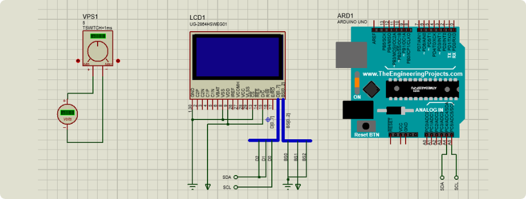
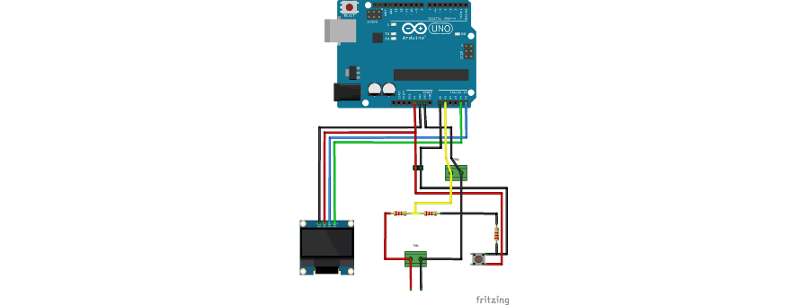
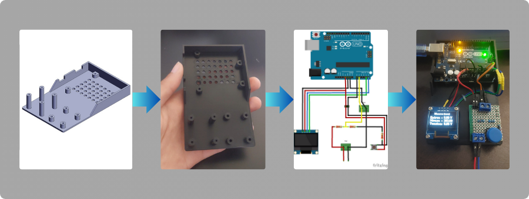

[](https://elmadichoaib.vercel.app)

# Water Level Monitoring System

This project demonstrates a water level monitoring system using an ultrasonic sensor and an Arduino. The system measures the water level in a container based on input voltage and displays the height on an OLED screen. Future enhancements include integrating a PID controller for automated water level regulation.

<div align="center">



</div>

## Project Structure

```
.
├── 3D Models/
├── Circuit Diagram/
│ ├── circuit-diagram.png
│ └── proteus-simulation.pdsprj
├── Images/
├── Programs/
│ ├── Main/
│ │ └── Main.ino
│ └── Tests/
└── README.md
```

## System Overview

The water container setup includes:

- **Ultrasonic Sensor**: Positioned at the top of the container, measuring distance using ultrasonic waves.
- **Water Container**: Marked with height indicators in millimeters.
- **Input/Output**:
  - A pipe at the top for filling water.
  - An opening at the bottom for draining water.

## Hardware Components

- Arduino
- Ultrasonic water level sensor (output: 0V to 10V)
- Voltage divider (to scale voltage for Arduino input)
- OLED display
- Power supply
- 3D-printed enclosure

<div align="center">




</div>

## How It Works

1. The ultrasonic sensor measures the distance to the water surface and outputs a voltage.

2. The voltage is scaled using a voltage divider to match the Arduino’s input range.

3. The Arduino calculates the water height using the formula derived from measurements.

4. The height and original sensor voltage are displayed on the OLED screen.

## Future Goals

- **PID Controller**: Automate water level regulation by controlling a pump for filling or a valve for draining.
- **Enhanced Display**: Show additional information such as target level and error margin.
- **Remote Monitoring**: Add IoT capabilities for remote water level tracking.

## Contributing

Contributions are welcome! If you have ideas for improvements or additional features, feel free to open an issue or submit a pull request.
